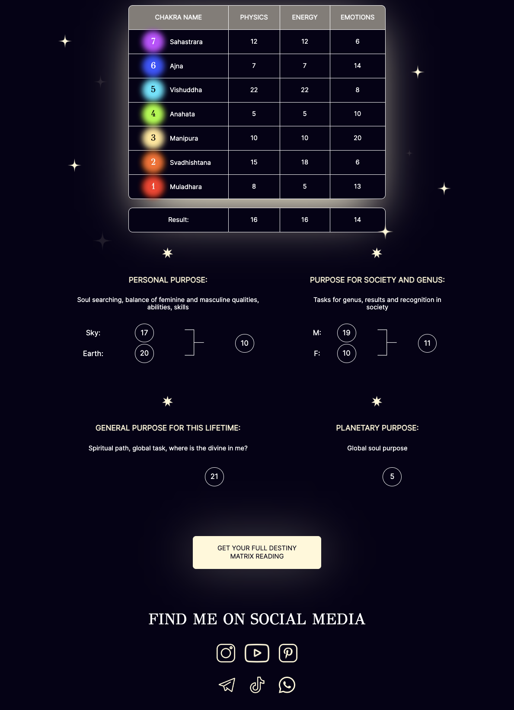

# Destiny Matrix

Destiny Matrix project is a programming project that involved the creation of two calculators designed to calculate Destiny Matrix. The project used technologies such as CSS, HTML, and JavaScript to create these two calculators on a user-friendly interface.

# Features

Destiny Matrix project includes two calculators that allow users to input their birthdate and calculate Destiny Matrix. The first calculator uses numerology to create a personalized numerology chart for users, while the second calculator uses astrology to determine the user's horoscope.

# How to Use

To use the Destiny Matrix project, simply open the project in your web browser and navigate to the calculators. From there, input your birthdate and the calculators will automatically calculate your Destiny Matrix.

[PERSONAL CALCULATION](https://goncharovastacy.github.io/DestinyMatrix/) |
[YOUR COMPATIBILITY](https://compatibilitymatrix.netlify.app/) 

# Contributors

<table>
  <tr>
<td align="center"><a href="https://github.com/berriestime"> <b>Elena</b></a></td>
<td align="center"><a href="https://github.com/goncharovastacy"> <b>Anastasia</b></a></td>
    <td align="center"><a href="https://github.com/aelita-dzhafarova"> <b>Aelita</b></a></td>
<td align="center"><a href="https://github.com/EvgeniiaShirshikova"> <b>Evgeniia</b></a></td>
<td align="center"><a href="https://github.com/Alesia-15"> <b>Alesia</b></a></td>
<td align="center"><a href="https://github.com/BarhatovaIrina"> <b>Irina</b></a></td>
</tr>
</table>
  
# Technologies Used
<code></code>
<code></code>
<code></code>

# License

Destiny Matrix project is licensed under the MIT license. Please see the `LICENSE` file for more information.
